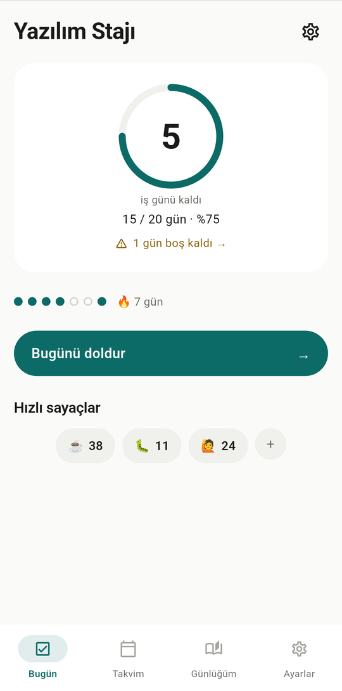
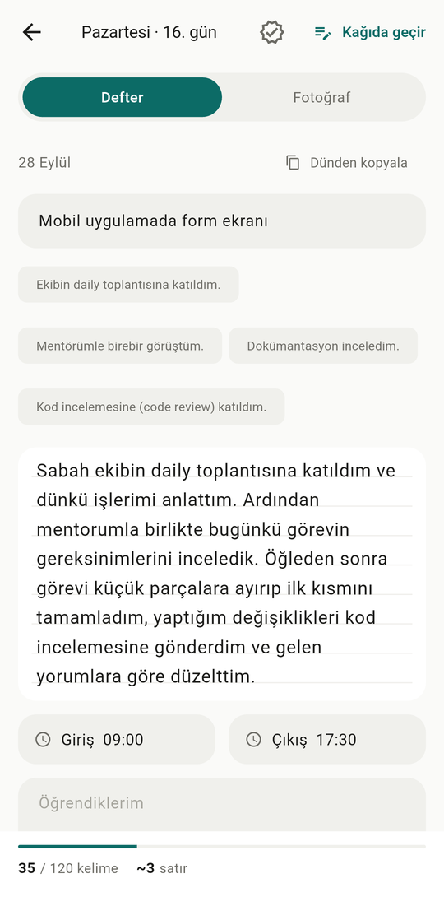
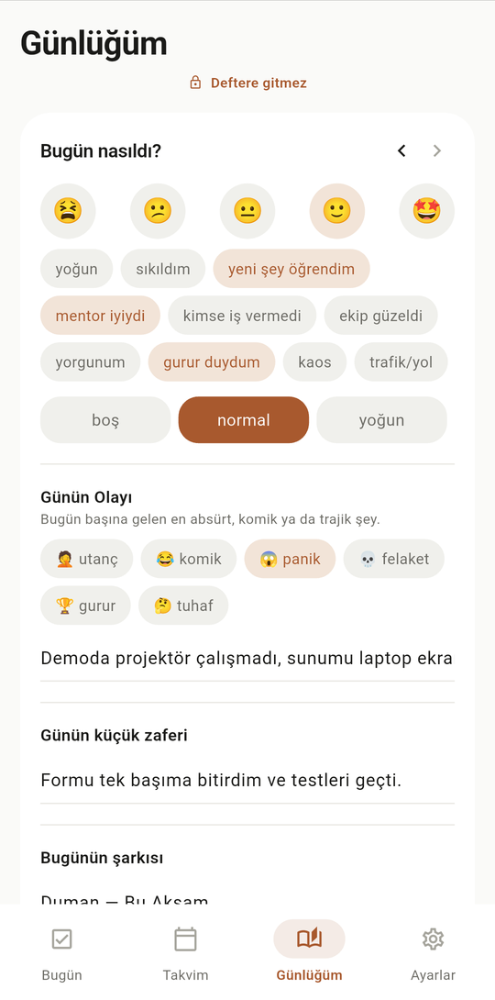
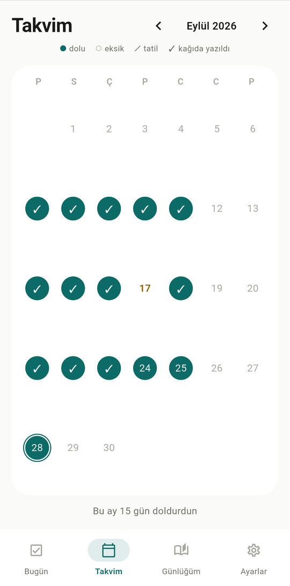
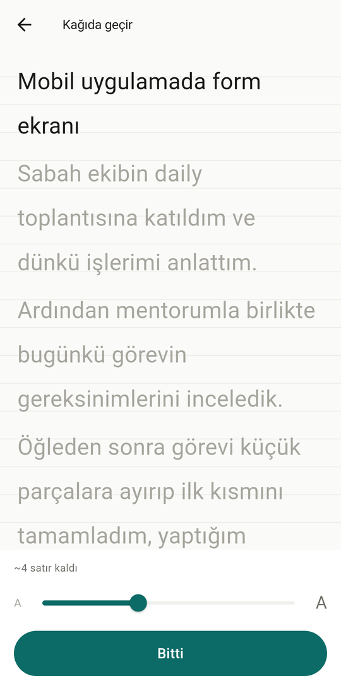
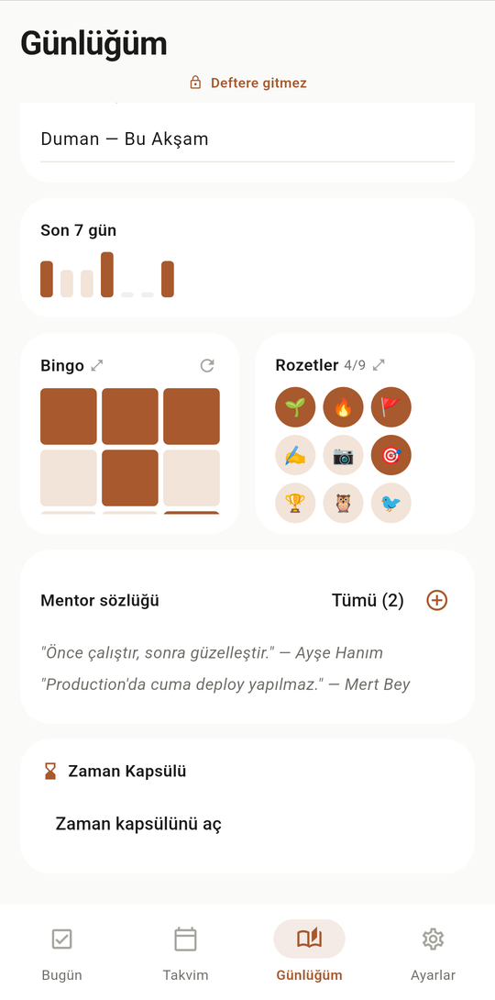
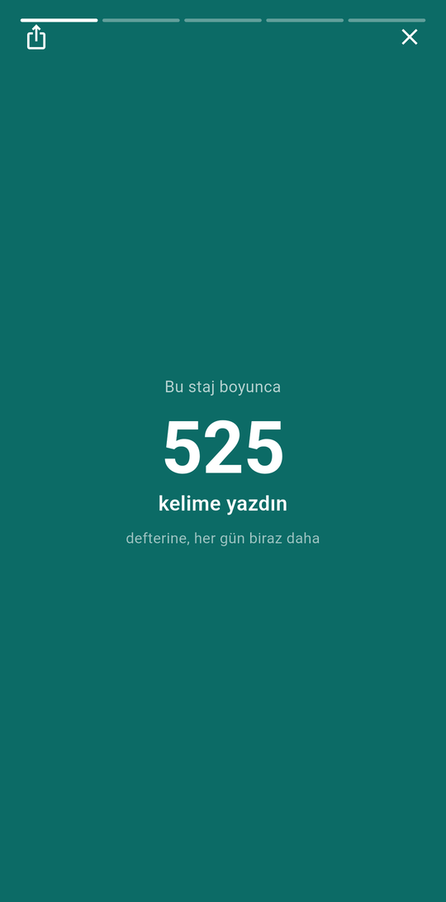
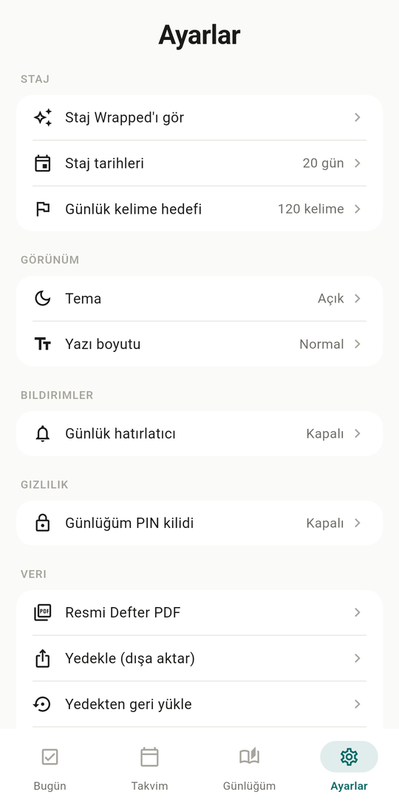

<p align="center">
  
</p>

<h1 align="center">Cepte Staj</h1>

<p align="center">
  Staj defterini elle yazmak zorunda olan öğrenciler için: gün içinde hızlıca not al,
  akşam kağıda geçir, stajını da hatırlanır bir deneyime dönüştür.
</p>

<p align="center">
  
  &nbsp;
  
  &nbsp;
  
</p>

Cepte Staj, **offline-first** bir Flutter uygulamasıdır. Hesap açmak gerekmez, sunucu
yoktur; tüm veriler yalnızca telefonda saklanır.

## Uygulamanın iki katmanı

| | **Resmi Defter** | **Staj Günlüğüm** (kişisel) |
|---|---|---|
| Ne için | Kağıda geçirilecek, amire imzalatılacak metin | Yalnızca senin için, stajın anısı |
| İçerik | Gün konusu, yapılan işler, giriş/çıkış saati, öğrendiklerin | Ruh hali, Günün Olayı, küçük zafer, şarkı, mentor sözleri, rozetler |
| PDF'e girer mi | Evet | **Hayır, asla** |

Bu ayrım bir ayar değil, **mimari bir kural**: PDF dışa aktarma (`lib/core/pdf_export.dart`)
yalnızca resmi alanları (`topic`, `body`, `learned`, `checkIn`/`checkOut`) ve
`includeInExport = true` işaretli fotoğrafları okur. Kişisel alanlara hiçbir zaman erişmez.

## Ekranlar

### Bugün
Kalan iş günü halkası, doldurulan gün oranı, boş kalan günler için uyarı, seri takibi ve
tek dokunuşla artan hızlı sayaçlar (☕ kahve, 🐛 çözülen hata, 🙋 sorulan soru).

### Takvim
Aylık görünümde her günün durumu bir bakışta görülür: dolu, eksik, tatil ve kağıda yazıldı ✓.
Resmi tatiller ve hafta sonları iş günü sayımına otomatik olarak dahil edilmez.

<p align="center">
  
  &nbsp;&nbsp;
  
</p>

### Gün Detayı: Defter ve Fotoğraf
**Defter** sekmesinde günün konusu, hazır ifadeler (tek dokunuşla eklenen cümleler), dünden
kopyala, giriş/çıkış saati ve öğrendiklerin bulunur. Alttaki sayaç günlük kelime hedefini ve
metnin kağıtta **kaç satır** tutacağını gösterir. Yazdıkların otomatik kaydedilir.
**Fotoğraf** sekmesinde galeriden ya da kameradan fotoğraf eklenir, açıklama yazılır ve
istenirse fotoğraf deftere (PDF'e) dahil edilmek üzere işaretlenir.

### Kağıda Geçirme Modu
Defter kaydını kağıda geçirirken kullanılan tam ekran mod: büyük punto, defter çizgileri,
kalan satır sayısı ve ayarlanabilir yazı boyutu.

<p align="center">
  
  &nbsp;&nbsp;
  
</p>

### Günlüğüm (kişisel)
Doldurması iş gibi hissettirmeyen kişisel katman: 5'li ruh hali, sebep etiketleri ve
iş yoğunluğu, kategorili **Günün Olayı** (🤦 utanç · 😂 komik · 😱 panik · 💀 felaket ·
🏆 gurur · 🤔 tuhaf), günün küçük zaferi ve bugünün şarkısı. Aynı sekmede son 7 günün
ruh hali grafiği, **Staj Bingo**, rozetler, mentor sözlüğü ve Zaman Kapsülü de yer alır.
Bu sekme PIN ile ayrıca kilitlenebilir.

Rozetler: İlk Gün · 7 Gün Seri · Yarı Yol · 1000 Kelime · İlk Fotoğraf · Bingo Satırı ·
Hiç Gün Kaçırmadın · Gece Yazarı · Erken Kuş.

<p align="center">
  
  &nbsp;&nbsp;
  
</p>

### Staj Wrapped ve Ayarlar
Stajının Spotify Wrapped tarzında, kaydırmalı ve paylaşılabilir özeti (Ayarlar'dan açılır).
Ayarlar'da staj tarihleri, kelime hedefi, açık/koyu tema, yazı boyutu, günlük hatırlatıcı,
PIN kilidi, **Resmi Defter PDF** çıktısı ve yedekleme/geri yükleme bulunur.

<p align="center">
  
  &nbsp;&nbsp;
  
</p>

## Mimari

- **State yönetimi:** `provider` ile tek bir `ChangeNotifier` (`lib/data/app_state.dart`);
  tüm ekranlar bu tek kaynağı okur ve yazar.
- **Kalıcılık:** Backend ve veritabanı yok. `lib/core/local_store.dart` tüm uygulama durumunu
  tek bir JSON olarak `shared_preferences` içine yazar. Yazma işlemleri kısa bir gecikmeyle
  toplanır; uygulama arka plana alındığında bekleyen değişiklikler hemen diske yazılır.
- **Veri modelleri:** `lib/models/models.dart` içinde `Internship`, `DayEntry` (resmi ve
  kişisel alanlar aynı kayıtta ama ayrı kullanımda), `DayPhoto`, `QuickCounter`,
  `MentorQuote`, `BingoTask`, `AppBadge`.
- **İş günü hesaplayıcı:** `lib/core/workday_calculator.dart`, Türkiye resmi tatillerini
  (`lib/core/holidays.dart`) ve seçilen çalışma günlerini hesaba katarak kalan/geçmiş iş
  günlerini ve tahmini bitiş tarihini hesaplar. Birim testlidir.
- **Rozet motoru:** `lib/core/achievements.dart`, her kayıttan sonra çalışan saf (yan
  etkisiz) bir fonksiyondur.
- **PDF:** `lib/core/pdf_export.dart`, Türkçe karakter destekli (Roboto, `assets/fonts/`)
  bir "Resmi Defter" PDF'i üretir ve `share_plus` ile paylaşır.
- **Yedekleme:** `lib/core/backup_service.dart`, kişisel katman dahil tüm durumu bir `.json`
  dosyasına aktarır ve geri yükler. Bu, PDF'ten farklı olarak yalnızca kullanıcının kendisi
  içindir.
- **Bildirimler:** `lib/core/notification_service.dart`, `flutter_local_notifications` ve
  `timezone` ile günlük hatırlatmayı zamanlar.
- **PIN kilidi:** `lib/core/pin.dart`, PIN'i tuzlanmış SHA-256 özeti olarak saklar.

Renk, yazı ve boşluk token'ları `lib/theme/` altındadır. Resmi defter tarafının vurgu rengi
mürekkep teal'i (`#0C6B66`), kişisel günlük tarafınınki terra'dır (`#A8592E`). Kartlar
kenarlıkla değil zemin tonu farkıyla ayrışır; açık ve koyu tema desteklenir.

## Geliştirme

Standart bir Flutter projesidir (Android öncelikli).

```bash
flutter pub get
flutter run                  # bağlı cihazda çalıştır
flutter test                 # birim + widget testleri
flutter analyze              # statik analiz
flutter build apk --release  # APK: build/app/outputs/flutter-apk/
```

**Klasör yapısı**

```
lib/
  main.dart              uygulama girişi, tema ve Provider kurulumu
  core/                  iş günü hesabı, tatiller, rozetler, PDF, yedek, bildirim, PIN
  data/app_state.dart    uygulamanın tüm durumu (tek ChangeNotifier)
  models/models.dart     veri modelleri (JSON serileştirme dahil)
  features/onboarding/   onboarding akışı
  screens/               bugün, takvim, gün detayı, kağıda geçir, günlüğüm, wrapped, ayarlar
  theme/                 renk, yazı ve boşluk token'ları
  widgets/               ortak bileşenler
test/                    WorkdayCalculator, PDF export ve widget testleri
```

## Gizlilik

Tüm veriler yalnızca cihazda saklanır, hiçbir sunucuya gönderilmez. Kişisel katman
(Günlüğüm) PDF dışa aktarımına asla dahil edilmez ve isteğe bağlı olarak ayrı bir PIN ile
kilitlenebilir.

> README'deki ekran görüntüleri örnek staj verisiyle alınmıştır.
